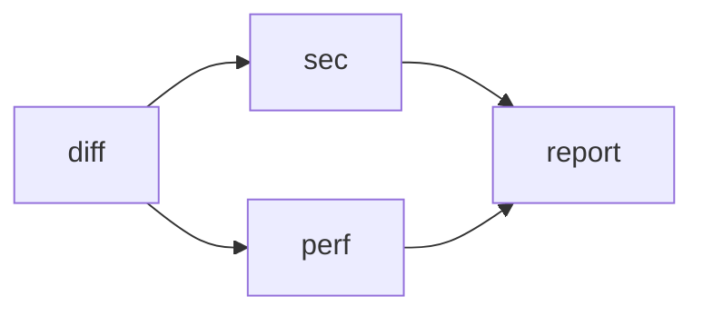
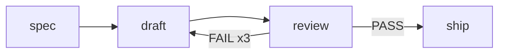

# PROP-0001: Workflow orchestration for subagents

## Status

Draft — 2026-09-11. No code accompanies this proposal.

Once built, the behaviour belongs in `concepts/workflow.md`; this page stays
as the record of how the design was arrived at. Whether any of it also needs
an ADR is a question for that point, not this one.

## Motivation

San can already fan out. The main agent issues several `Agent` calls in one
turn, and `subagent.Executor.RunBackground` gives each of them a task, a
transcript, and a completion notification. Parallelism is not the gap.

Three things it cannot do:

- **Save a recipe.** A useful arrangement of agents — collect the diff, split
  the review three ways, merge the findings — exists only for the length of
  one turn. The next session rebuilds it from scratch, differently.
- **Guarantee an order the model cannot forget.** Dependencies live in the
  main agent's head. A long turn, a compaction, or a distracted step and the
  merge runs before one of its inputs finished.
- **Keep orchestration out of the main context.** Every worker result lands
  in the main conversation whether or not the main agent needs to read it.
  Fanning out to eight workers costs eight results' worth of context to
  produce one summary.

Two systems solve the general version of this problem, and they disagree:

| | LangGraph | Argo Workflows |
| --- | --- | --- |
| Graph | cyclic state machine | acyclic declarative DAG |
| Node | a function mutating shared state | a container |
| Data | shared state with reducers | outputs referenced by name |
| Branching | `add_conditional_edges` + arbitrary Python | `when:` expression |
| Dynamic fan-out | `Send` | `withParam` |
| Cycles | the headline feature | not supported |

`genai-io/sdk-go` v0.5.0 stops at a single agent: `pkg/ai` makes one model
call, `pkg/agent` runs the loop around it. Grepping `pkg/` for
`workflow|orchestrat|subagent|handoff` returns nothing. The rung above
`agent.Agent` — many loops in an order — is empty, in the SDK and in San.

## Goals

- A workflow is a file: reviewable, diffable, re-runnable, and identical
  whether a person or the model authored it.
- Dependencies are structural, so a long turn cannot forget an ordering.
- Orchestration stays out of the main conversation's context.
- Worst-case cost is computable before launch, and stated at approval time.
- Every node passes the permission gate an ordinary subagent passes.

## Non-Goals

- **Unbounded cycles.** A bounded back edge is supported; an open loop is not.
- **An expression language** for conditions. String equality only.
- **Shared mutable state** across nodes, in the LangGraph sense.
- **A second evaluator-optimizer** inside a node: one node is already a loop.
- **`for_each` inside a loop body** — dynamic x iteration is a cartesian
  explosion.
- **Replacing the `Agent` tool.** Ad-hoc fan-out in a single turn stays the
  right answer for work that is not worth saving.

## Design

A declarative acyclic graph whose nodes are subagent turns, defined in
markdown, executable from a saved file or from a model-authored tool call.

### 1. Argo-shaped, not LangGraph-shaped

Take Argo's shape — declarative, acyclic, parameterized. Do not take
LangGraph's cycles as a general feature.

LangGraph's headline capability is a liability here. A cycle exists to
"reason repeatedly until satisfied", and a San node is *already* a full
reason-and-act loop that runs up to 500 steps, calls its own tools, and
decides when it is done. Re-implementing that loop in the orchestration
layer produces a worse copy: every lap re-composes a prompt and loses the
context the previous lap built.

What is rejected is not the back edge — it is the *unbounded* back edge. See
Design 6.

### 2. A node is one subagent turn

`subagent.Executor.Run` calls `core.agent.ThinkAct`, which drives exactly one
`sdkagent.Agent.Run` — one turn in the SDK's vocabulary: the loop runs until
the model stops asking for tools. A turn holds as many inferences and tool
calls as the work requires, capped by `defaultMaxSteps` (500).

A turn always terminates, with one of eight stop reasons.
`interpretStopReason` (`internal/subagent/executor.go:525`) treats exactly
one of them as success:

| `StopReason` | Meaning | Workflow verdict |
| --- | --- | --- |
| `end_turn` | the model stopped asking for tools | success |
| `max_steps` | hit the step cap | failed |
| `max_tokens` | output truncated, continuation did not finish it | failed |
| `refusal` | the model declined | failed |
| `canceled` | interrupted; partial work preserved | failed |
| `error` / hook | inference failed past retry, or a hook refused | failed |

Five of the six "did not finish" cases are therefore detectable by the graph.
The sixth is not: a model can stop asking for tools having done half the job,
and that reports as `end_turn`. **This is a known blind spot.** The mitigation
is structural rather than mechanical — a converging node that reviews its
inputs catches what the stop reason cannot.

### 3. Three kinds of edge

The graph holds three things. Every pattern in *Building Effective Agents* is
a composition of them, not a feature to support separately.

| Edge | Written | Meaning |
| --- | --- | --- |
| Sequence | `a --> b` | `b` waits for `a` and can read its output |
| Fan-out | `a --> b & c` | `b` and `c` start together, each reading `a` |
| Conditional | `a -->\|HIGH\| b` | `b` runs only when `a`'s output is `HIGH` |

| Pattern | Composition |
| --- | --- |
| Prompt chaining | sequence edges in a line |
| Gate | sequence plus one conditional |
| Routing | one classifying node, N mutually exclusive conditionals |
| Parallelization (sectioning) | fan-out, then converge |
| Parallelization (voting) | the same, with *heterogeneous* branches |
| Orchestrator–workers | `for_each` (Design 6) |
| Evaluator–optimizer | a bounded back edge (Design 6) |

Voting deserves a note. Running one prompt three times on one model produces
three highly correlated judgements, not three samples; a majority vote over
them buys far less confidence than it appears to. Useful multi-way judgement
is heterogeneous — different agents, different models (San already routes
`vendor/model` across providers), different vantage points. A "repeat N
times" quantifier would express only the useless half, so there is no such
field: voting is sectioning with branches configured differently.

### 4. Definition: markdown whose topology is a mermaid flowchart

Node configuration and graph shape are two different things, and nesting them
in one YAML tree is what makes that YAML verbose. Separate them: the topology
is one mermaid block, each node is one markdown section. This also matches
how every other extension point in San is already defined — agents, skills
and commands are all markdown with frontmatter.

````markdown
---
name: review
max_parallel: 4
---



## diff
agent: Explore

Summarize the changes in main..HEAD, grouped by package

## sec
mode: explore

Security only: {{diff}}

## perf
mode: explore

Performance regressions only: {{diff}}

## report
Merge into one review: {{sec}} {{perf}}
````

| Part | Rule |
| --- | --- |
| mermaid block | the only source of topology. `-->` sequence, `&` fan-out and fan-in, `\|LABEL\|` conditional. A cycle without a bound is a parse error. |
| `## id` | one node. Every id in the graph needs a section and vice versa. |
| `key: value` under the heading | the contiguous run of such lines is node config (`agent`, `mode`, `model`, `continue_on_error`, `for_each`, `max_workers`); everything after the blank line is the prompt. Most nodes need none. |
| `{{id}}` | an upstream node's output. Referencing a node the graph does not connect is a validation error, not an empty value. |
| `{{input.x}}` | a parameter passed at trigger time. |

`needs` disappears — it is read off the graph. So do the `nodes:` nesting,
the quoting and `\n` escaping of prompts, and `.steps.x.output`.

### 5. Two front doors, one format

- **User-authored**: `.san/workflows/*.md` and `~/.san/workflows/*.md`, loaded
  with the same precedence rule `internal/subagent/loader.go` uses for agents.
- **Model-authored**: the `Workflow` tool takes that same markdown document
  as one string parameter.

One format, not two. A workflow the model wrote is the same artifact a person
writes: readable, editable, savable, re-runnable. A structured JSON `nodes`
array in the tool schema would have been marginally safer to emit and would
have created a second dialect to keep in sync.

### 6. Bounded dynamism

Both dynamic patterns are supported, under one condition: **the worst-case
cost must be computable before the workflow starts.**

**Orchestrator–workers** inverts the usual direction. The orchestrator does
not call workers; it returns a plan, and the runner expands that plan into
real nodes. Each worker is an ordinary node passing through the ordinary
permission gate with its own transcript, so the flat agent model is
untouched — nothing recursively spawns anything.

```markdown
## plan
Split the review into non-overlapping tasks, at most 8, as JSON:
{"tasks":[{"name":"llm","prompt":"Review error handling in internal/llm"}]}

## review
for_each: plan.tasks
max_workers: 8
agent: Explore
mode: explore

{{item.prompt}}
```

`for_each` covers both shapes: string items give an ordinary map (review each
file), object items give an orchestrator (each worker carries its own
prompt). `max_workers` is **required** — a plan that goes wrong otherwise
starts two hundred subagents.

**Evaluator–optimizer** needs a back edge, so the back edge is drawn in the
graph, and its bound is part of the syntax. A back edge without `xN` fails
validation.



Parsing unrolls it into a plain DAG — `draft#1 → review#1 → draft#2 → …`
with a `PASS` escape edge from each iteration to `ship` — so the executor,
the scheduler and the renderer never learn that a loop existed.

| Case | Semantics |
| --- | --- |
| `{{review}}` inside `draft` | the previous iteration's output; empty on the first |
| `{{review}}` inside `ship` | the last iteration that actually ran |
| all iterations exhausted, still FAIL | the workflow fails — the condition was not met, and a bad result does not travel onward |
| back edge target | must be an ancestor of its source, else it is not a loop |
| `for_each` inside a loop body | rejected: dynamic × iteration is a cartesian explosion |

Splitting writer from critic is the point of the pattern: the critic runs in
a clean context instead of grading what it just wrote itself.

Because `xN` and `max_workers` are mandatory, the permission dialog can state
the bound — `review: up to 8 workers`, `draft/review: up to 3 rounds`. That
is not a nicety; it is the reason these two patterns are admissible at all.

### 7. Execution semantics

| Situation | Behaviour |
| --- | --- |
| upstream failed | downstream skipped, workflow fails; `continue_on_error: true` overrides per node |
| upstream omitted (conditional not taken) | downstream is omitted only when **all** its upstreams are; one surviving upstream is enough to run, and the missing `{{x}}` renders empty |
| template scope | only upstreams the graph connects, plus `{{input.*}}` |
| concurrency | `max_parallel`, default 4 |
| cancellation | `AgentStop` on the workflow task; ctx propagates to every in-flight node, finished output is kept |
| permissions | every node passes the same subagent gate, Ask collapsing to Deny. `mode` accepts `explore`, `edit`, `default` only — **`bypass` is unreachable**, including from file-defined workflows, since the project directory is not trusted |
| validation | unique ids · graph ids match sections · Kahn cycle check · agent names resolve · mode in whitelist · templates reference connected upstreams only. All before launch, reported at once |
| tool scope | `Workflow` joins `parentOnlyTools` in `internal/tool/set.go`: a subagent cannot start a workflow |

### 8. Terminal rendering

Nothing renders mermaid in San today — `grep -rn mermaid internal/` is empty,
and glamour treats the fence as an ordinary code block. Nor is a mermaid
renderer needed: by the time anything is drawn, the graph has been parsed
into nodes and edges. This is a layout problem, not a mermaid problem.

The graph is drawn as ASCII, laid out left to right, with state on the node:

```
✓ diff ─┬─▶ ⠹ perf   ─────────────┐
        ├─▶ ✓ tests  ─────────────┤
        ╰─▶ ✓ triage ─┬HIGH▶ ⠼ sec    ─┤
                      ├HIGH▶ ⠴ threat ─┤
                      ╰LOW ▶ ⊘ quick ╌╌┴─▶ ◇ report

⠼ sec      ▸ Read internal/llm/vendor.go        0:44
⠴ threat   ▸ Grep "os.Getenv"                   0:38
⠹ perf     ▸ Bash go test -bench .              0:42
```

The graph is *cheaper* in rows than a list: its height is the maximum
parallelism, not the node count — eight nodes in five rows. That matters,
because the panel it lives in has a row budget. Long text (the tool trail)
sits below the graph rather than inside it, which is what keeps the graph
compact.

Three constraints come from the existing TUI and shape all of the above:

- `internal/app/conv/tracker_view.go` is pinned above the input, not written
  to scrollback, and caps at `maxVisibleItems = 8`, folding finished rows
  into a summary line.
- Scrollback is immutable (the root cause behind #314). Animated multi-line
  output must stay in the pinned region; only the collapsed summary is
  committed.
- Liveness comes from the runtime, not from persisted status (#342): that is
  what `Executing` is for, alongside the `Blink` frame clock and
  `AgentColors`.

Layout runs once and is cached as a character grid; each frame repaints only
glyphs and colours. Five steps, roughly 130 lines: Kahn layering gives the
columns (the scheduler computes it anyway), rows are assigned greedily
against the first upstream's row, edges spanning more than one column get
pass-through placeholders so every edge crosses exactly one gutter, and each
gutter draws `┬` at the source row, `╰▶` at the target, `│` between.

Liveliness costs no animation code: glyphs spin in place on the existing
frame clock, traversed edges render one step brighter than untraversed ones,
running nodes take their agent's colour, and the graph *grows* — a `for_each`
column gains rows the moment the orchestrator returns its plan, and a back
edge's `⟲2/3` advances when an iteration fails.

Degradation belongs to the renderer, not to a mode the user picks: too many
parallel rows fold to `⋮ 3 more`, too many columns truncate with a pointer to
`/workflow show`, and a graph too tangled to draw falls back to one node per
row.

Two things come for free: `todo.Item` already carries `Blocks` / `BlockedBy`,
so nodes registered as tracker items get dependencies and progress; and
`charm.land/lipgloss/v2/tree` is a sibling of the `lipgloss/v2/table` already
imported by `internal/app/conv/markdown.go`, so the box-drawing costs no new
dependency.

### 9. Package placement

`internal/workflow` holds parsing, validation, expansion and the DAG runner,
with **no San imports** — standard library, `yaml`, and one type parameter
for the host's per-node configuration. Node execution enters through a
single-method interface that `internal/tool/workflow` satisfies by adapting
`tool.AgentExecutor`.

That constraint exists so the package can move. Once the schema settles,
`git mv` puts it in sdk-go as `pkg/agent/flow`, completing the ladder the
SDK's architecture doc describes: `ai.Client` is one call, `agent.Agent` is
one loop, `flow.Flow` is many loops in an order. Two implementations of the
node executor exist from the first day — a bare `agent.New` in the SDK, and
San's gated `subagent.Executor` — so the seam is load-bearing rather than
speculative.

## Alternatives considered

| Alternative | Why not |
| --- | --- |
| A JS script with `agent()` / `parallel()` / `pipeline()` primitives, as Claude Code's Workflow tool does | Needs an embedded JS runtime and a sandbox in Go. Buys arbitrary control flow the declarative graph covers at a fraction of the cost. |
| LangGraph's cyclic `StateGraph` with shared state | Cycles duplicate what a node already is. Shared state is worse here than in ordinary programs: state is fed into prompts, so "any node may read any field" is context pollution nobody wrote down. |
| A `repeat: N` quantifier for voting | Replicates identical configuration, which is the half of voting that carries no information. Useful multi-way judgement is heterogeneous, and sectioning already expresses it. |
| A structured JSON `nodes` array as the tool schema | Marginally safer for a model to emit, at the cost of a second dialect diverging from the file format. |
| `when:` on each downstream node instead of labelled edges | Scatters one routing decision across N nodes with no way to check exhaustiveness. |
| Leaving orchestrator-workers to the main agent | Works, but every worker result lands in the main context to produce one summary. |

## Risks and trade-offs

- A second execution surface next to the `Agent` tool, with its own failure
  modes and its own rendering.
- A mermaid subset parser to maintain. It is a small, line-based subset, but
  it is a dialect, and users will write mermaid that the subset rejects.
- The `end_turn`-but-unfinished blind spot is inherited from the subagent
  layer and becomes more visible when nodes chain: an unfinished node feeds
  a converging node that cannot tell.
- A model that can start workflows will start them where a single `Agent`
  call would have done. The tool description has to push back, the way the
  `Agent` tool's does.

## Implementation plan

| Phase | Scope | Size |
| --- | --- | --- |
| P1 | mermaid subset + markdown sections + Kahn validation + wave scheduling + templates + `Workflow` tool (inline document) + background task + summary. Covers chaining, gate, routing, sectioning, voting. | ~350 |
| P2 | `.san/workflows/` + `~/.san/workflows/` loading, `{{input.*}}`, `/workflow` builtin prompt command, `for_each` + `max_workers` + JSON plan extraction, bounds in the permission dialog. Covers orchestrator–workers. | ~150 |
| P3 | back-edge detection, `xN` bounds, unrolling to `draft#1…#N` with escape edges, previous-iteration template binding, exhaustion as failure. Executor unchanged. Covers evaluator–optimizer. | ~130 |
| P4 | full-screen lane graph (`/workflow`), if the panel view proves insufficient. | ~180 |

| File | Contents |
| --- | --- |
| `internal/workflow/parse.go` | mermaid subset, markdown sections, validation |
| `internal/workflow/expand.go` | back-edge unrolling, `for_each` materialization, bound arithmetic |
| `internal/workflow/run.go` | Kahn layering, concurrency cap, templates, node-executor seam |
| `internal/workflow/run_test.go` | stub executor: ordering, concurrency, conditional omission, failure propagation, unbounded back edge rejected, cost ceiling |
| `internal/tool/workflow/` | the tool, permission preview listing nodes and bounds, background launch |
| `internal/app/conv/workflow_view.go` | layered layout cached as a character grid, repainted per frame |
| `internal/tool/schema.go`, `set.go` | `ToolWorkflow`, `builtinToolOrder`, `parentOnlyTools` |
| `internal/agent/build.go` | executor injection, mirroring the `Agent` tool's `SetExecutor` |
| `docs/reference/package-map.md` | register the new package, or `make lint` fails |
| `docs/concepts/workflow.md` | written with P1, describing what exists |

## Open questions

- **How strict is the mermaid subset?** A user will write valid mermaid the
  parser rejects — subgraphs, node shapes, `direction`. Reject loudly with a
  pointer to what is supported, or silently ignore the unsupported syntax?
  Leaning: reject, because a silently dropped edge is a silently wrong graph.
- **Does the `end_turn`-but-unfinished blind spot need a mechanical guard?**
  A per-node `expect:` assertion is one option, and the beginning of a
  slippery slope back toward an expression language.
- **What does `{{x}}` render to when `x` failed and `continue_on_error` let
  the graph continue?** Empty string loses the diagnosis; the error text may
  mislead a downstream node into treating it as content.
- **Is P4's lane graph ever needed?** Decide after P1 has run real
  workflows, not before.
- **Should a workflow be resumable?** Deferred entirely. Nothing here
  persists partial state, so a cancelled workflow restarts from the top.

## References

- [`ADR-0001`](../decisions/0001-layered-package-architecture.md) — layering
  and the package-map requirement this feature must satisfy.
- [`concepts/permission-model.md`](../../concepts/permission-model.md) — the
  gate every node passes through.
- [`concepts/extension-model.md`](../../concepts/extension-model.md) — how
  agents, skills and commands are defined; workflows follow the same shape.
- [`reference/package-map.md`](../../reference/package-map.md) — where
  `internal/workflow` must be registered.
- Anthropic, *Building Effective Agents* — the pattern vocabulary used in
  Design 3, and its distinction between workflows and agents.
- Argo Workflows — `dependencies`, `when`, `withParam`, `templateRef`.
- `genai-io/sdk-go` `docs/agent.md` — turn and inference vocabulary, the
  eight stop reasons, and the package's stated scope boundaries.
