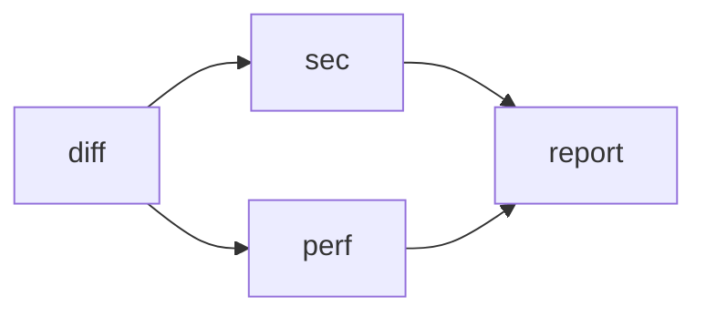
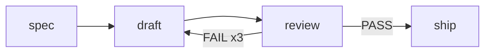

# PROP-0001：子 Agent 工作流编排

> 英文版：[`0001-workflow-orchestration.md`](0001-workflow-orchestration.md)

## 状态

Draft — 2026-09-11。本提案不附带任何代码。

落地之后，行为描述归 `concepts/workflow.md`，本页则留作"当初是怎么想的"
的记录。其中是否有内容还需要单独写成 ADR，是到那时才该回答的问题，不是现在。

## 动机

San 已经能扇出了。主 agent 在一个 turn 里发多个 `Agent` 调用，
`subagent.Executor.RunBackground` 给每个都配了任务、transcript 和完成通知。
缺的不是并行。

缺的是三件事：

- **存不下配方。** 一套有用的 agent 编排——收集 diff、三路拆分审查、合并结论
  ——只存在于那一个 turn 里。下一次会话从头重建，而且建得不一样。
- **保证一个模型忘不掉的顺序。** 依赖关系长在主 agent 脑子里。turn 一长、
  一次压缩、一步走神，合并节点就会在它的某个输入还没跑完时开跑。
- **让编排不占主上下文。** 每个 worker 的结果都会落进主对话，不管主 agent
  要不要读它。扇出到八个 worker，为了产出一份汇总，要付八份结果的上下文。

有两个系统解决了这个问题的通用版本，而它们的答案相反：

| | LangGraph | Argo Workflows |
| --- | --- | --- |
| 图 | 有环状态机 | 无环声明式 DAG |
| 节点 | 一个修改共享 state 的函数 | 一个容器 |
| 数据 | 带 reducer 的共享 state | 按名字引用节点输出 |
| 分支 | `add_conditional_edges` + 任意 Python | `when:` 表达式 |
| 动态扇出 | `Send` | `withParam` |
| 环 | 头号卖点 | 不支持 |

`genai-io/sdk-go` v0.5.0 到单 agent 为止：`pkg/ai` 做一次模型调用，
`pkg/agent` 跑它外面那个循环。在 `pkg/` 里 grep
`workflow|orchestrat|subagent|handoff` 零命中。`agent.Agent` 上面那一级
——多个循环按顺序跑——是空的，SDK 里空，San 里也空。

## 目标

- 工作流是一个文件：可 review、可 diff、可重跑，人写的和模型写的是同一种东西。
- 依赖是结构性的，一个长 turn 没法忘掉顺序。
- 编排不进主对话的上下文。
- 最坏成本在启动前可算出来，并在审批时如实告知。
- 每个节点都走普通子 agent 走的那道权限闸门。

## 非目标

- **无界的环。** 有界回边支持，开放循环不支持。
- **条件表达式语言。** 只做字符串相等比较。
- **跨节点共享可变 state**，LangGraph 那个意义上的。
- **在节点内再实现一遍 evaluator–optimizer**：一个节点本身就是一个循环。
- **循环体里的 `for_each`** —— 动态 × 迭代是笛卡尔爆炸。
- **取代 `Agent` 工具。** 不值得存下来的活，单个 turn 里临时扇出仍然是对的做法。

## 设计

一张声明式无环图，节点是子 agent 的一次 turn，用 markdown 定义，
可以从存好的文件触发，也可以由模型现场写出来触发。

### 1. 取 Argo 的形状，不取 LangGraph 的

取 Argo 的形状——声明式、无环、可参数化。不把 LangGraph 的环当成通用特性收进来。

LangGraph 的头号能力在这里是负资产。环的存在是为了"反复推理直到满意"，
而 San 的一个节点**本身就是**完整的 reason-and-act 循环：能跑到 500 步、
自己调工具、自己判断做完没有。在编排层再实现一遍这个循环，产出的是一个更差的
副本——每一圈都要重新组 prompt，并丢掉上一圈建立起来的上下文。

被拒的不是回边，是**无界**的回边。见设计第 6 节。

### 2. 节点 = 一次子 agent turn

`subagent.Executor.Run` 调 `core.agent.ThinkAct`，后者恰好驱动一次
`sdkagent.Agent.Run`——也就是 SDK 词汇里的一个 turn：循环跑到模型不再要工具为止。
一个 turn 里可以有任意多次推理和工具调用，上限是 `defaultMaxSteps`（500）。

turn 一定会终止，终止时带八种 stop reason 之一。
`interpretStopReason`（`internal/subagent/executor.go:525`）只把其中一种算成功：

| `StopReason` | 含义 | 工作流判定 |
| --- | --- | --- |
| `end_turn` | 模型不再要工具了 | 成功 |
| `max_steps` | 撞到步数上限 | 失败 |
| `max_tokens` | 输出被截断，续写也没写完 | 失败 |
| `refusal` | 模型拒答 | 失败 |
| `canceled` | 被中止，部分产出保留 | 失败 |
| `error` / hook | 推理失败超出重试预算，或被 hook 拦下 | 失败 |

所以"没干完"的六种情况里，五种图能检测到。第六种不能：模型可以在只做了一半的
情况下停止索要工具，而那报告为 `end_turn`。**这是一个已知盲区。**
缓解手段是结构性的而非机械的——让一个汇聚节点去审查它的输入，
接住 stop reason 接不住的东西。

### 3. 三种边

图里只有三样东西。《Building Effective Agents》里的每一个模式都是这三样的组合，
不是需要单独支持的特性。

| 边 | 写法 | 含义 |
| --- | --- | --- |
| 顺序 | `a --> b` | `b` 等 `a`，并能读到它的输出 |
| 扇出 | `a --> b & c` | `b` `c` 同时开跑，各拿一份 `a` 的输出 |
| 条件 | `a -->\|HIGH\| b` | `a` 的输出等于 `HIGH` 时 `b` 才跑 |

| 模式 | 组装方式 |
| --- | --- |
| Prompt chaining | 顺序边连成一条线 |
| Gate | 顺序边加一条条件边 |
| Routing | 一个分类节点 + N 条互斥条件边 |
| Parallelization（sectioning） | 扇出，再汇聚 |
| Parallelization（voting） | 同上，但各路**异构** |
| Orchestrator–workers | `for_each`（设计第 6 节） |
| Evaluator–optimizer | 有界回边（设计第 6 节） |

Voting 值得单说。同一个 prompt 在同一个模型上跑三遍，得到的是三份高度相关的
判断，不是三个样本；在它们之上做多数表决，买到的确定性远低于看上去的那么多。
有用的多路判断是异构的——不同 agent、不同模型（San 本来就支持 `vendor/model`
跨 provider 路由）、不同视角。一个"重复 N 次"的量词只能表达没用的那一半，
所以没有这个字段：voting 就是各路配置不同的 sectioning。

### 4. 定义：拓扑是一张 mermaid 流程图的 markdown

节点配置和图的形状是两件事，把它们嵌套进同一棵 YAML 树，正是那份 YAML 啰嗦的原因。
拆开：拓扑是一个 mermaid 块，每个节点是一个 markdown 段落。这也和 San 现有的
每一个扩展点对得上——agent、skill、command 全都是带 frontmatter 的 markdown。

````markdown
---
name: review
max_parallel: 4
---



## diff
agent: Explore

总结 main..HEAD 的改动，按包分组

## sec
mode: explore

只看安全：{{diff}}

## perf
mode: explore

只看性能回退：{{diff}}

## report
合并成一份评审：{{sec}} {{perf}}
````

| 部件 | 规则 |
| --- | --- |
| mermaid 块 | 唯一的拓扑来源。`-->` 顺序，`&` 扇出与汇聚，`\|LABEL\|` 条件。没有上界的环是解析错误。 |
| `## id` | 一个节点。图里的每个 id 都要有对应段落，反之亦然。 |
| 标题下的 `key: value` | 连续的这些行是节点配置（`agent`、`mode`、`model`、`continue_on_error`、`for_each`、`max_workers`）；空行以下全是 prompt。大多数节点一行都不需要。 |
| `{{id}}` | 上游节点的输出。引用图里没连过来的节点是校验错误，不是空值。 |
| `{{input.x}}` | 触发时传入的参数。 |

`needs` 消失了——它从图里读出来。一起消失的还有 `nodes:` 嵌套、prompt 的引号和
`\n` 转义、以及 `.steps.x.output`。

### 5. 两个入口，一个格式

- **用户写的**：`.san/workflows/*.md` 与 `~/.san/workflows/*.md`，
  加载优先级与 `internal/subagent/loader.go` 加载 agent 的规则一致。
- **模型写的**：`Workflow` 工具接收同一份 markdown 文档，作为一个字符串参数。

一个格式，不是两个。模型写出来的工作流和人写的是同一件东西：可读、可改、可存、可重跑。
在工具 schema 里用结构化 JSON `nodes` 数组会让模型输出略微更安全，代价是多出一种
需要保持同步的方言。

### 6. 有界的动态

两个动态模式都支持，条件只有一条：**最坏成本必须在工作流启动前可算。**

**Orchestrator–workers** 把方向反过来。orchestrator 不调用 worker，
它返回一份计划，由 runner 把计划展开成真实节点。每个 worker 都是普通节点，
走普通权限闸门，有自己的 transcript——所以扁平的 agent 模型没被动，
没有任何东西在递归派生。

```markdown
## plan
把审查拆成互不重叠的任务，最多 8 个，输出 JSON：
{"tasks":[{"name":"llm","prompt":"审查 internal/llm 的错误处理"}]}

## review
for_each: plan.tasks
max_workers: 8
agent: Explore
mode: explore

{{item.prompt}}
```

`for_each` 覆盖两种形状：项是字符串就是普通 map（逐个文件审查），
项是对象就是 orchestrator（每个 worker 带自己的 prompt）。
`max_workers` 是**必填**的——否则一份写飞的计划会拉起两百个子 agent。

**Evaluator–optimizer** 需要回边，那就把回边画进图里，并把它的上界写进语法。
没有 `xN` 的回边校验不过。



解析期把它展开成一张普通 DAG —— `draft#1 → review#1 → draft#2 → …`，
每一轮都有一条 `PASS` 逃逸边通向 `ship` —— 所以执行器、调度器和渲染器
从头到尾都不知道曾经有过一个循环。

| 情形 | 语义 |
| --- | --- |
| `{{review}}` 写在 `draft` 里 | 上一轮的输出；第一轮为空 |
| `{{review}}` 写在 `ship` 里 | 实际跑过的最后一轮 |
| 所有轮次耗尽，仍然 FAIL | 工作流失败——条件没满足，坏结果不往下走 |
| 回边的目标 | 必须是源节点的祖先，否则不构成循环 |
| 循环体里的 `for_each` | 拒绝：动态 × 迭代是笛卡尔爆炸 |

把 writer 和 critic 拆开正是这个模式的意义：critic 跑在干净上下文里，
而不是给自己刚写的东西打分。

因为 `xN` 和 `max_workers` 是强制的，权限对话框可以把上界说出来——
`review：最多 8 个 worker`、`draft/review：最多 3 轮`。这不是锦上添花，
这是这两个模式能被接纳的全部理由。

### 7. 执行语义

| 情况 | 行为 |
| --- | --- |
| 上游失败 | 下游 skip，工作流失败；节点上的 `continue_on_error: true` 可放行 |
| 上游被 omit（条件边没选中） | 下游只在**所有**上游都 omitted 时才 omitted；只要有一个上游活着就照跑，缺失的 `{{x}}` 渲染为空 |
| 模板可见范围 | 只有图里连过来的上游，加上 `{{input.*}}` |
| 并发 | `max_parallel`，默认 4 |
| 取消 | `AgentStop` 打在工作流任务上；ctx 传播到所有在飞节点，已完成的产出保留 |
| 权限 | 每个节点走同一道子 agent 闸门，Ask 塌缩成 Deny。`mode` 只接受 `explore`、`edit`、`default`——**`bypass` 不可达**，文件定义的工作流同样如此，因为项目目录本来就不可信 |
| 校验 | id 唯一 · 图里的 id 与段落一一对应 · Kahn 查环 · agent 名可解析 · mode 在白名单内 · 模板只引用连过来的上游。全部在启动前完成，一次报完 |
| 工具边界 | `Workflow` 加入 `internal/tool/set.go` 的 `parentOnlyTools`：子 agent 不能启动工作流 |

### 8. 终端渲染

San 现在没有任何东西渲染 mermaid —— `grep -rn mermaid internal/` 是空的，
glamour 把那个围栏当普通代码块。也不需要 mermaid 渲染器：
真要画的时候，图已经被解析成节点和边了。这是布局问题，不是 mermaid 问题。

图用 ASCII 画，从左到右排布，状态长在节点上：

```
✓ diff ─┬─▶ ⠹ perf   ─────────────┐
        ├─▶ ✓ tests  ─────────────┤
        ╰─▶ ✓ triage ─┬HIGH▶ ⠼ sec    ─┤
                      ├HIGH▶ ⠴ threat ─┤
                      ╰LOW ▶ ⊘ quick ╌╌┴─▶ ◇ report

⠼ sec      ▸ Read internal/llm/vendor.go        0:44
⠴ threat   ▸ Grep "os.Getenv"                   0:38
⠹ perf     ▸ Bash go test -bench .              0:42
```

图在行数上比列表**更省**：它的高度是最大并行度，不是节点数——八个节点五行。
这一点很关键，因为承载它的面板有行预算。长文本（工具轨迹）放在图下面而不是图里面，
这正是图能保持紧凑的原因。

有三条约束来自现有 TUI，上面的一切都由它们塑形：

- `internal/app/conv/tracker_view.go` 钉在输入框上方，不写进 scrollback，
  上限 `maxVisibleItems = 8`，超出就把已完成的行折叠成一条摘要。
- scrollback 不可变（#314 的根因）。会动的多行输出必须留在钉住区，
  只有坍缩后的摘要才提交进去。
- 活性来自运行时，而不是持久化状态（#342）：这正是 `Executing` 的用处，
  与 `Blink` 帧时钟和 `AgentColors` 配合。

布局只算一次，缓存成一张字符网格；每帧只重绘字形和颜色。五步，约 130 行：
Kahn 分层给出列（调度器本来就要算），行号按第一个上游贪心分配，
跨多列的边插入 pass-through 占位使每条边恰好跨一个沟槽，
每个沟槽在源行画 `┬`、目标行画 `╰▶`、中间画 `│`。

生动不需要动画代码：字形在既有帧时钟上原地旋转，走过的边比没走过的亮一档，
运行中的节点取它那个 agent 的颜色，而图会**长大**——orchestrator 一交出计划，
`for_each` 那一列当场长出新行；一轮失败时回边上的 `⟲2/3` 当场跳。

退化是渲染器的事，不是用户要选的模式：并行行太多就折叠成 `⋮ 3 more`，
列太多就截断并提示去 `/workflow show`，图乱到画不清就退回一行一个节点。

有两样是白送的：`todo.Item` 本来就带 `Blocks` / `BlockedBy`，
注册成 tracker item 的节点就有依赖和进度；而 `charm.land/lipgloss/v2/tree`
是 `internal/app/conv/markdown.go` 已经在用的 `lipgloss/v2/table` 的同包兄弟，
画框线不引入新依赖。

### 9. 包的归属

`internal/workflow` 装解析、校验、展开和 DAG runner，**零 San import**——
只有标准库、`yaml`，以及一个承载宿主节点配置的类型参数。节点执行通过一个
单方法接口进入，由 `internal/tool/workflow` 适配 `tool.AgentExecutor` 来满足。

这条约束的存在就是为了让这个包能搬家。schema 稳定之后，`git mv` 把它放进
sdk-go 作为 `pkg/agent/flow`，补齐 SDK 架构文档描述的那条阶梯：
`ai.Client` 是一次调用，`agent.Agent` 是一个循环，`flow.Flow` 是多个循环的顺序。
节点执行器从第一天起就有两个实现——SDK 里裸的 `agent.New`，和 San 这边带闸门的
`subagent.Executor`——所以这个接缝是承重的，不是投机的。

## 考虑过的其他方案

| 方案 | 为什么不用 |
| --- | --- |
| 像 Claude Code 的 Workflow 工具那样，用带 `agent()` / `parallel()` / `pipeline()` 原语的 JS 脚本 | 要在 Go 里嵌一个 JS 运行时并做沙箱。买到的任意控制流，声明式图用零头的成本就覆盖了。 |
| LangGraph 的有环 `StateGraph` 加共享 state | 环重复了一个节点本身就是的东西。共享 state 在这里比在普通程序里更糟：state 是要喂进 prompt 的，"任何节点可读任何字段"是没人写下来的上下文污染。 |
| 给 voting 加一个 `repeat: N` 量词 | 复制的是完全相同的配置，也就是 voting 里不携带信息的那一半。有用的多路判断是异构的，而 sectioning 已经能表达。 |
| 工具 schema 用结构化 JSON `nodes` 数组 | 模型输出略微更安全，代价是多一种会和文件格式分叉的方言。 |
| 用每个下游节点上的 `when:` 代替带标签的边 | 把一个路由决策打散到 N 个节点，且无从检查是否互斥穷尽。 |
| Orchestrator–workers 交给主 agent | 能用，但每个 worker 的结果都要落进主上下文，只为产出一份汇总。 |

## 风险与取舍

- 在 `Agent` 工具之外多了第二个执行面，带着自己的失败模式和自己的渲染。
- 要维护一个 mermaid 子集解析器。它是个很小的、按行解析的子集，
  但它是一种方言，用户会写出子集不接受的合法 mermaid。
- `end_turn` 但没干完这个盲区继承自子 agent 层，在节点串起来之后更显眼：
  一个没干完的节点喂给一个看不出来的汇聚节点。
- 一个能启动工作流的模型，会在一次 `Agent` 调用就够的场合去启动工作流。
  工具描述必须往回压，就像 `Agent` 工具的描述现在做的那样。

## 实施计划

| 阶段 | 范围 | 规模 |
| --- | --- | --- |
| P1 | mermaid 子集 + markdown 分段 + Kahn 校验 + 波次调度 + 模板 + `Workflow` 工具（内联文档）+ 后台任务 + 汇总。覆盖 chaining、gate、routing、sectioning、voting。 | ~350 |
| P2 | `.san/workflows/` 与 `~/.san/workflows/` 加载、`{{input.*}}`、`/workflow` 内置 prompt command、`for_each` + `max_workers` + JSON 计划提取、权限对话框显示上界。覆盖 orchestrator–workers。 | ~150 |
| P3 | 回边识别、`xN` 上界、展开成 `draft#1…#N` 加逃逸边、上一轮输出的模板绑定、耗尽即失败。执行器零改动。覆盖 evaluator–optimizer。 | ~130 |
| P4 | 全屏泳道图（`/workflow`），如果面板视图被证明不够用。 | ~180 |

| 文件 | 内容 |
| --- | --- |
| `internal/workflow/parse.go` | mermaid 子集、markdown 分段、校验 |
| `internal/workflow/expand.go` | 回边展开、`for_each` 展开出真实节点、上界核算 |
| `internal/workflow/run.go` | Kahn 分层、并发上限、模板、节点执行器接缝 |
| `internal/workflow/run_test.go` | stub executor：顺序、并发、条件 omit、失败传染、无界回边被拒、成本上界 |
| `internal/tool/workflow/` | 工具本体、列出节点与上界的权限预览、后台启动 |
| `internal/app/conv/workflow_view.go` | 分层布局缓存成字符网格，逐帧重绘 |
| `internal/tool/schema.go`、`set.go` | `ToolWorkflow`、`builtinToolOrder`、`parentOnlyTools` |
| `internal/agent/build.go` | 注入 executor，照 `Agent` 工具的 `SetExecutor` |
| `docs/reference/package-map.md` | 登记新包，否则 `make lint` 挂 |
| `docs/concepts/workflow.md` | 随 P1 一起写，描述已经存在的东西 |

## 待决问题

- **mermaid 子集要多严格？** 用户会写出解析器不接受的合法 mermaid——subgraph、
  节点形状、`direction`。是大声报错并指明支持什么，还是静默忽略不支持的语法？
  倾向报错，因为被静默丢掉的一条边就是一张静默错误的图。
- **`end_turn` 但没干完这个盲区需要机械防护吗？** 节点级的 `expect:` 断言是一个
  选项，也是滑回表达式语言的开端。
- **当 `x` 失败而 `continue_on_error` 放行时，`{{x}}` 应该渲染成什么？**
  空串丢掉了诊断信息；错误文本又可能被下游节点当成内容。
- **P4 的泳道图真的需要吗？** 等 P1 跑过真实工作流之后再决定，不是现在。
- **工作流需要可续跑吗？** 完全推迟。现在不持久化任何中间状态，
  被取消的工作流从头重跑。

## 参考

- [`ADR-0001`](../decisions/0001-layered-package-architecture.md) —— 分层规则，
  以及本功能必须满足的 package-map 登记要求。
- [`concepts/permission-model.md`](../../concepts/permission-model.md) ——
  每个节点都要穿过的那道闸门。
- [`concepts/extension-model.md`](../../concepts/extension-model.md) ——
  agent、skill、command 是怎么定义的；工作流沿用同一形状。
- [`reference/package-map.md`](../../reference/package-map.md) ——
  `internal/workflow` 需要登记的地方。
- Anthropic，《Building Effective Agents》—— 设计第 3 节使用的模式词汇，
  以及它对 workflow 与 agent 的区分。
- Argo Workflows —— `dependencies`、`when`、`withParam`、`templateRef`。
- `genai-io/sdk-go` 的 `docs/agent.md` —— turn 与 inference 的词汇、
  八种 stop reason，以及该包自述的范围边界。
